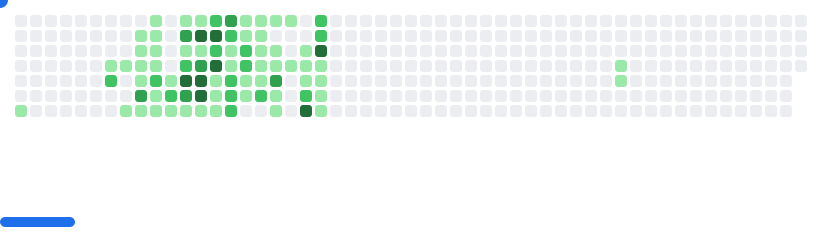

# 👤 I Am Shadow

<details>
  <summary><strong>🌑 About Me</strong></summary>
<br/>
I am Reymund Virtus, a full-stack engineer operating quietly and crafting systems from the shadows.

I wield **Python**, **TypeScript**, and **PHP** as my core arsenal, building everything from sleek web interfaces to robust mobile solutions.  
I specialize in **serverless technologies**, seamlessly integrating AWS and Azure to deliver scalable, event-driven architectures.

My realm spans the full stack, from intuitive UI interactions to data pipelines and infrastructure as code.  
From RESTful APIs to real-time systems, I deploy with precision and purpose.

In the silence, I thrive.  
While others chase trends, I study **emerging technologies**, master them, and bend them to my will.

> *Where others see complexity, I see patterns.*

A mere shadow, blending into the silence, while crafting world-altering code in the dark.

> *I don’t need recognition.* 
> *I don’t need applause.*  
> *Because in the world of systems and services...*  
> *I am the one who holds the architecture together.*  
> *I am Atomic.* 💥

##### *Contact shadow here:* [](mailto:rvirtus@proton.me)

</details>

---

<details>
  <summary><strong>🛠️ Tech Stack</strong></summary>

  
#### DevOps & Cloud:
 
 
 
 
 
 
<!--  -->
#### Backend:
 
 
 
 
<!--  --> 
#### Database:
 
 
 
 
<!--  -->
<!--  -->
#### Frontend:
 
 
 
 
<!--  -->
<!--  -->
<!--  -->
#### Mobile Development:
 
 
#### Developer Tools:
 
 
 
 
 
 
<!--  -->
<!--   -->
<!--   -->
#### AI Tools:
 
 
 
 
<!--  -->
</details>

---

<details>
  <summary><strong>🔮 Stats</strong></summary>
<br/>
  
<!--START_SECTION:waka-->
**I'm a Night 🦉** 

```text
🌞 Morning                140 commits         ████░░░░░░░░░░░░░░░░░░░░░   14.63 % 
🌆 Daytime                170 commits         ████░░░░░░░░░░░░░░░░░░░░░   17.76 % 
🌃 Evening                318 commits         ████████░░░░░░░░░░░░░░░░░   33.23 % 
🌙 Night                  329 commits         █████████░░░░░░░░░░░░░░░░   34.38 % 
```
📅 **I'm Most Productive on Wednesday** 

```text
Monday                   160 commits         ████░░░░░░░░░░░░░░░░░░░░░   16.72 % 
Tuesday                  152 commits         ████░░░░░░░░░░░░░░░░░░░░░   15.88 % 
Wednesday                190 commits         █████░░░░░░░░░░░░░░░░░░░░   19.85 % 
Thursday                 118 commits         ███░░░░░░░░░░░░░░░░░░░░░░   12.33 % 
Friday                   147 commits         ████░░░░░░░░░░░░░░░░░░░░░   15.36 % 
Saturday                 90 commits          ██░░░░░░░░░░░░░░░░░░░░░░░   09.40 % 
Sunday                   100 commits         ███░░░░░░░░░░░░░░░░░░░░░░   10.45 % 
```


📊 **This Week I Spent My Time On** 

```text
💬 Programming Languages: 
Bash                     2 hrs 42 mins       ████████░░░░░░░░░░░░░░░░░   31.45 % 
TypeScript               1 hr 54 mins        ██████░░░░░░░░░░░░░░░░░░░   22.09 % 
Markdown                 1 hr 25 mins        ████░░░░░░░░░░░░░░░░░░░░░   16.58 % 
TeX                      1 hr 13 mins        ████░░░░░░░░░░░░░░░░░░░░░   14.12 % 
CSV                      1 hr 4 mins         ███░░░░░░░░░░░░░░░░░░░░░░   12.50 % 
```


<!--END_SECTION:waka-->
</details>

---

<div align="center" width="100%">
  <table>
    <tr>
      <td align="left" valign="center" width="50%">
        <h5 align="center">🎯 Projects I'm Building & Maintaining</h5>
          <hr />
          &emsp;&emsp;🔗 <a href="https://zume.reymundvirtus.com/" style="text-decoration: none;"><strong>Zume: AI-Powered Resume Builder</strong></a>
          <br />
          &emsp;&emsp;🔗 <a href="https://personalink-b181a.web.app/" style="text-decoration: none;"><strong>PersonaLink</strong></a>
          <br />
          &emsp;&emsp;🔗 <a href="#" style="text-decoration: none; color: blue;"><strong>RephraseIt (Coming Soon 🚀)</strong></a>
        <br />
        <br />
        <br />
      </td>
      <td align="center" valign="top" width="50%">
        <h5 align="center">
          &nbsp; Last Played
        </h5>
          <hr />
        <a href="#">
          
        </a>
      </td>
    </tr>
  </table>
</div>

---

<picture>
  <source
    media="(prefers-color-scheme: dark)"
    srcset="images/breakout-dark.svg"
  />
  <source
    media="(prefers-color-scheme: light)"
    srcset="images/breakout-light.svg"
  />
  
</picture>
